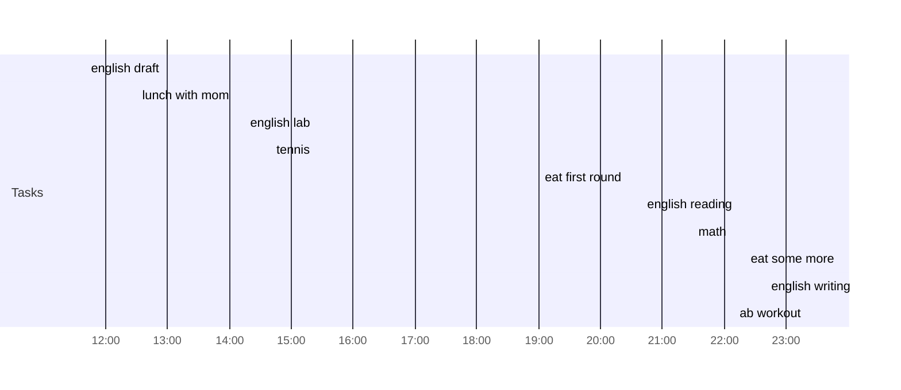

## Day Planner

- [x] 11:40 english draft
- [x] 12:30 lunch with mom
- [x] 14:15 english lab
- [x] 14:40 tennis
- [x] 19:00 eat first round
- [x] 20:40 english reading
- [x] 21:30 math
- [x] 22:20 eat some more
- [x] 22:40 english writing
- [x] 23:20 ab workout