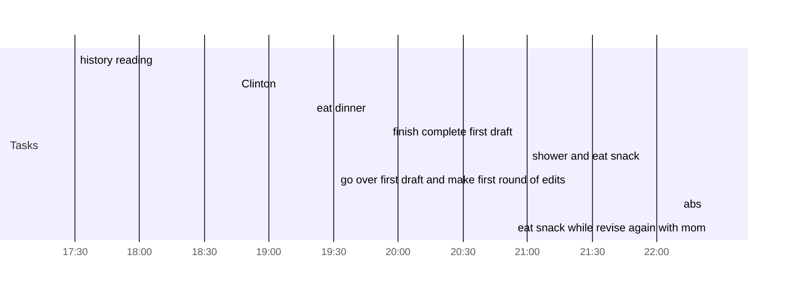

## Day Planner

- [x] 17:30 history reading
- [x] 18:45 Clinton
- [x] 19:20 eat dinner
- [x] 19:55 finish complete first draft
- [x] 21:00 shower and eat snack
- [x] 21:20 go over first draft and make first round of edits
	- [ ] add more description
- [x] 22:10 abs
- [x] 22:25 eat snack while revise again with mom