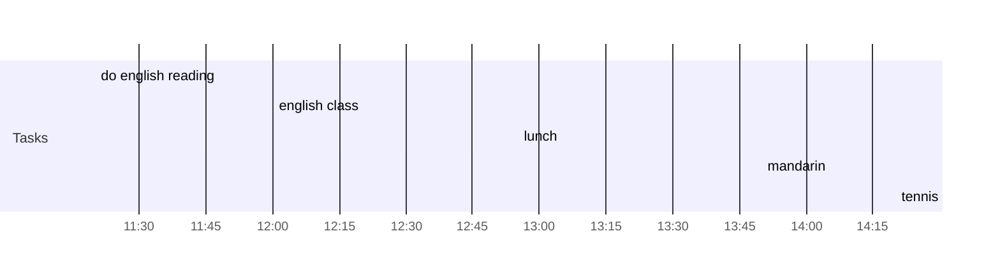

## Day Planner

```mermaid
gantt
    dateFormat  HH-mm
    axisFormat %H:%M
    %% Current Time: 11:10:09 PM
    section Tasks
    do english reading     :11-20, 40mm
    english class     :12-00, 55mm
    lunch     :12-55, 55mm
    mandarin     :13-50, 30mm
    tennis     :14-20, 0mm
    section Breaks

```

- [x] 11:20 do english reading
- [ ] 11:35: mandarin
- [x] 12:00 english class
- [x] 12:55 lunch
- [x] 13:50 mandarin
- [x] 14:20 tennis