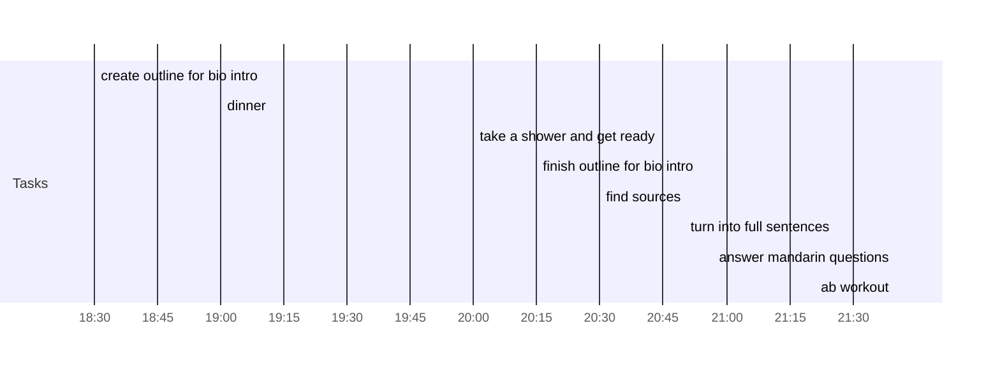

## Day Planner

- [x] 18:30 create outline for bio intro
- [x] 19:00 dinner
- [x] 20:00 take a shower and get ready
- [x] 20:15 finish outline for bio intro
- [x] 20:30 find sources
- [x] 20:50 turn into full sentences
- [x] 21:40 answer mandarin questions
- [x] 21:40 ab workout