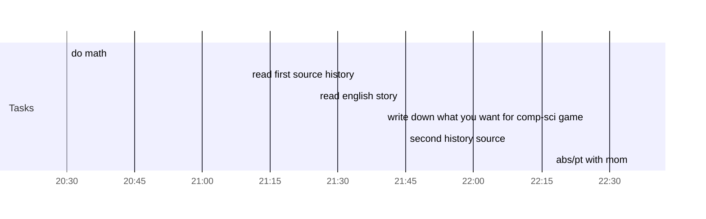

## Day Planner

- [x] 20:30 do math
- [x] 21:10 read first source history
- [x] 21:25 read english story
- [x] 21:40 write down what you want for comp-sci game
- [x] 21:45 second history source
- [x] 22:35 abs/pt with mom